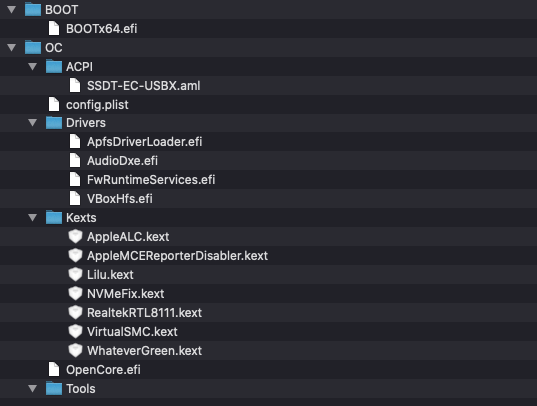

# Personal Config for OpenCore

## Scheme 

## Setup

+ **Processor**: Ryzen 5 3600
+ **MoBo**: ASUS TUF B450 PLUS GAMING
+ **RAM**: 16GB DDR4
+ **Video**: GIGABYTE RADEON 5700 XT

## About config.plist

### ACPI
#### Add
+ SSDT-EC-USBX.aml Make sure this file is in your OC/ACPI directory

#### Quirks
+ **FadtEnableReset = No**
+ **NormalizeHeaders = No**
+ **RebaseRegions = No**
+ **ResetHwSig = No**
+ **ResetLogoStatus = No**
### Booter
#### Quirks
+ **AvoidRuntimeDefrag = Yes**
+ **DevirtualiseMmio = No**
+ **DisableSingleUser = No**
+ **DisableVariableWrite = No**
+ **DiscardHibernateMap = No**
+ **EnableSafeModeSlide = Yes**
+ **EnableWriteUnprotector = Yes**
+ **ForceExitBootServices = No**
+ **ProtectCsmRegion = No**
+ **ProtectSecureBoot = No**
+ **ProvideCustomSlide = Yes**
+ **SetupVirtualMap = Yes**
+ **ShrinkMemoryMap = No**
+ **SignalAppleOS = No**
### Kernel
#### Add
+ **Lilu.kext** make sure this Kext is in your **OC/Kexts** directory and the first kext listed here
+ **VirtualSMC.kext** make sure this Kext is in your **OC/Kexts**  directory
+ **AppleALC.kext** make sure this Kext is in your **OC/Kexts**  directory
+ **AppleMCEReporterDisabler**.kext make sure this Kext is in your **OC/Kexts**  directory
+ **NVMeFix.kext** make sure this Kext is in your **OC/Kexts**  directory
+ **RealtekRTL8111.kext** make sure this Kext is in your **OC/Kexts**  directory
+ **WhateverGreen.kext** make sure this Kext is in your **OC/Kexts**  directory
#### Quirks
+ **AppleCpuPmCfgLock = No**
+ **AppleXcpmCfgLock = No**
+ **AppleXcpmExtraMsrs = No**
+ **AppleXcpmForceBoost = No**
+ **CustomSMBIOSGuid = No**
+ **DisableIoMapper = No**
+ **DummyPowerManagement = Yes**
+ **ExternalDiskIcons = No**
+ **IncreasePciBarSize = No**
+ **LapicKernelPanic = No**
+ **PanicNoKextDump = Yes**
+ **PowerTimeoutKernelPanic = Yes**
+ **ThirdPartyDrives = No**
+ **XhciPortLimit = Yes** turn off after USB port mapping
#### Patch
+ AMD kernel patches
### Misc
#### Boot
+ **HideSelf = Yes**
+ **PollAppleHotKeys = No**
+ **ShowPicker = Yes**
+ **TakeoffDelay = 0**
+ **HibernateMode = None**
+ **PickerMode = Builtin**
+ **HideAuxiliary = No**
+ **PickerAttributes = 0**
+ **PickerAudioAssist = No**
+ **Timeout = 5**
#### Debug
+ **DisableWatchDog** enabling this will help debugging
+ **Target** see the Debugging Docs for more info on debug target numbers
+ **DisplayLevel** see Debugging Docs for more info debug display levels
+ **DisplayDelay = 0**
#### Security
+ **AllowNvramReset = Yes**
+ **AllowSetDefault = Yes**
+ **AuthRestart = No**
+ **Vault = Optional**
+ **HaltLevel = 2147483648**
+ **ExposeSensitiveData = 6**
+ **ScanPolicy = 0**
#### Tools
+ You removed the tool EFIs
### NVRAM
+ **LegacyEnable = No**
+ **LegacyOverwrite = No**
+ **WriteFlash = Yes**
#### Add
+ **UIScale = 01**
+ **DefaultBackgroundColor = 00000000**
+ **boot-args = -v keepsyms=1 agdpmod=pikera alcid=1 npci=0x2000** please remove npci=0x200 if 4G Decoding is enabled in your mobo UEFI options
+ **csr-active-config = 00000000**
+ **prev-lang:kbd = es:87 (es:87)**
+ **SystemAudioVolume = 46**

### PlatformInfo
+ **Automatic = Yes**
+ **UpdateDataHub = Yes**
+ **UpdateNVRAM = Yes**
+ **UpdateSMBIOS = Yes**
+ **UpdateSMBIOSMode = Create**
#### Generic
+ **SpoofVendor = Yes**
+ **AdviseWindows = No**
+ **SystemProductName = MacPro7,1**
+ **MLB** is set
+ **ROM** is set
+ **SystemSerialNumber** is set
+ **SystemUUID** is set
### UEFI
+ **ConnectDrivers = Yes**
#### Drivers
+ **VBoxHfs.efi**
+ **FwRuntimeServices.efi**
+ **ApfsDriverLoader.efi**
+ **AudioDxe.efi**
#### Audio
+ **AudioSupport = No**
+ **AudioDevice = PciRoot(0x0)/Pci(0x1b,0x0)**
+ **AudioCodec = 0**
+ **AudioOut = 0**
+ **MinimumVolume = 20**
+ **PlayChime = No**
+ **VolumeAmplifier = 0**
#### Input
+ **KeyForgetThreshold = 5**
+ **KeyMergeThreshold = 2**
+ **KeySupport = Yes**
+ **KeySupportMode = Auto**
+ **KeySwap = No**
+ **PointerSupport = No**
+ **PointerSupportMode = ASUS** but should normally be **-blank-**
+ **TimerResolution = 50000**
#### Output
+ **TextRenderer = BuiltinGraphics**
+ **ConsoleMode = -blank-**
+ **Resolution = Max**
+ **ClearScreenOnModeSwitch = No**
+ **IgnoreTextInGraphics = No**
+ **ProvideConsoleGop = Yes**
+ **DirectGopRendering = No**
+ **ReconnectOnResChange = No**
+ **ReplaceTabWithSpace = No**
+ **SanitiseClearScreen = No**
#### Protocols
+ **AppleAudio = No**
+ **AppleBootPolicy = No**
+ **AppleEvent = No**
+ **AppleImageConversion = No**
+ **AppleKeyMap = No**
+ **AppleSmcIo = No**
+ **AppleUserInterfaceTheme = No**
+ **DataHub = No**
+ **DeviceProperties = No**
+ **FirmwareVolume = No**
+ **HashServices = No**
+ **OSInfo = No**
+ **UnicodeCollation = No**
#### Quirks
+ **ExitBootServicesDelay = 0**
+ **IgnoreInvalidFlexRatio = No**
+ **ReleaseUsbOwnership = No**
+ **RequestBootVarFallback = Yes**
+ **RequestBootVarRouting = Yes**
+ **UnblockFsConnect = No**